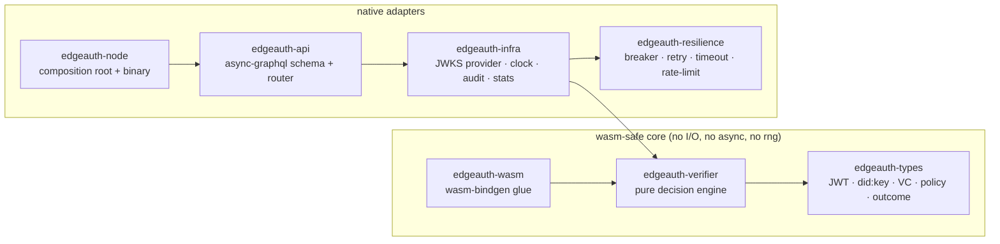
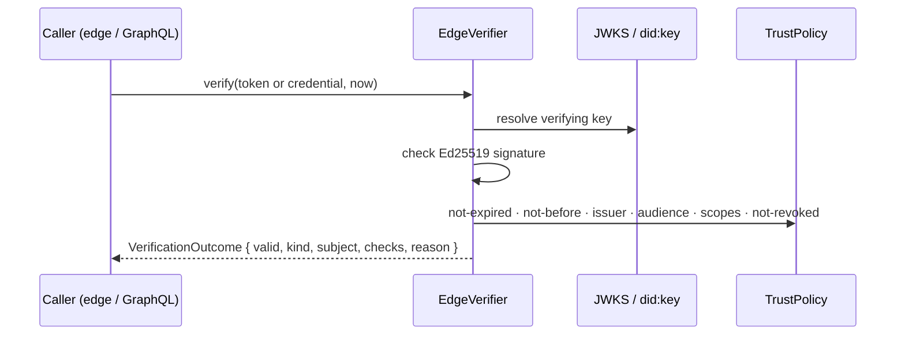

# EdgeAuth

[](.github/workflows/ci.yml)
[](rust-toolchain.toml)
[](#deploying-to-the-edge-wasm)
[](#license)

**A stateless, cold-start-optimized identity verifier for the network edge.**

EdgeAuth validates two kinds of credentials at the door of your application —
without a database, a session store, or a network round-trip:

- **EdDSA (Ed25519) JWT access tokens** against a JWKS (RFC 7515/7517/8037), and
- **W3C `did:key` Verifiable Credentials** with detached Ed25519 proofs.

The verification core carries **no async runtime, no I/O and no randomness**, so
it compiles unchanged to `wasm32-unknown-unknown` and runs inside Cloudflare
Workers, Fastly Compute, Deno Deploy or any serverless edge — while the same
core is wrapped by a native `axum` + GraphQL server for container deployments.

EdgeAuth is deliberately a **verifier, not an issuer**: it holds no signing keys
and mints nothing in production. It interoperates byte-for-byte with its sibling
issuers — it verifies JWTs minted by **AuthForge** and Verifiable Credentials
issued by **TrustFabric**.

---

## Highlights

| | |
|---|---|
| **Stateless** | No database, no cache, no sessions. A policy is pure configuration and safe to ship to every edge location. |
| **WASM-native** | The `types`, `verifier` and `wasm` crates build to `wasm32-unknown-unknown`; the release artifact is ~313 KB before `wasm-opt`. |
| **Dual verification** | One decision engine for both JWTs and Verifiable Credentials, returning a uniform per-check outcome. |
| **Fast** | ~31 µs to verify a JWT end-to-end, dominated by the Ed25519 signature check itself. |
| **Type-safe** | Newtypes (`Did`), pinned algorithms, exhaustive `VerifyError`, and a pure core that cannot perform I/O. |
| **Resilient** | The optional remote-JWKS adapter is guarded by a circuit breaker, retries with backoff, and per-attempt timeouts. |
| **Observable** | Structured `tracing`, Prometheus metrics, an audit stream, and a live GraphQL subscription. |

---

## Architecture

Dependencies point inward (hexagonal / ports-and-adapters). The three crates on
the left are `wasm`-safe; the adapters on the right exist only in the native
server.



### Verification flow



Every check is reported individually, so a rejected artifact tells you *exactly*
why (`signature`, `not_expired`, `issuer_trusted`, `audience`, …) rather than a
single opaque boolean.

---

## Workspace layout

| Crate | Responsibility | wasm-safe |
|---|---|:---:|
| [`edgeauth-types`](crates/edgeauth-types) | JWT/JWK, `did:key`, Verifiable Credential, trust policy, outcome types | ✅ |
| [`edgeauth-verifier`](crates/edgeauth-verifier) | Pure verification engine + criterion benches | ✅ |
| [`edgeauth-wasm`](crates/edgeauth-wasm) | `wasm-bindgen` entry points (`cdylib`) | ✅ |
| [`edgeauth-resilience`](crates/edgeauth-resilience) | Circuit breaker, retry+backoff, timeout, rate limiter | native |
| [`edgeauth-infra`](crates/edgeauth-infra) | JWKS providers (static/cached), clock, audit sink, `EdgeVerifier` service | native |
| [`edgeauth-api`](crates/edgeauth-api) | `async-graphql` schema + `axum` router | native |
| [`edgeauth-node`](crates/edgeauth-node) | Config, telemetry, composition root, `serve`/`demo`/`verify` binary | native |

---

## Quick start

```bash
# 1. Run the self-contained demo (mints sample tokens with local keys and
#    verifies them, showing accept + every rejection reason).
cargo run -p edgeauth-node -- demo

# 2. Verify a token or credential offline from the CLI.
cargo run -p edgeauth-node -- verify --token "<jwt>"
cargo run -p edgeauth-node -- verify --credential '<vc-json>'

# 3. Start the native GraphQL server (playground at http://localhost:8080/graphql).
cargo run -p edgeauth-node -- serve
```

Example demo output:

```text
EdgeAuth demo — verifying with local key `edgeauth-local-1`

  [ACCEPT] valid JWT              subject=user-demo reason=-
  [REJECT] expired JWT            subject=user-demo reason=artifact has expired (exp)
  [REJECT] untrusted-issuer JWT   subject=user-demo reason=issuer is not trusted
  [REJECT] wrong-audience JWT     subject=user-demo reason=audience mismatch (aud)
  [ACCEPT] signed credential      subject=did:key:z6Mkw… reason=-
  [REJECT] tampered credential    subject=- reason=signature verification failed

stats: jwt accepted=1 rejected=3 | vc accepted=1 rejected=1
```

---

## GraphQL API

`POST /graphql` · playground on `GET /graphql` · subscriptions on `/graphql/ws`
· `GET /health` · `GET /metrics`.

| Operation | Type | Purpose |
|---|---|---|
| `health` | query | Liveness probe. |
| `apiVersion` | query | Running service version. |
| `trustPolicy` | query | The active trust policy (issuers, audience, scopes, leeway). |
| `jwks` | query | The currently trusted key set. |
| `stats` | query | Aggregate accept/reject counters. |
| `verifyJwt(token, audience?, requiredScopes?)` | mutation | Verify a JWT, optionally tightening audience/scopes per request. |
| `verifyCredential(credential)` | mutation | Verify a JSON `did:key` Verifiable Credential. |
| `refreshJwks` | mutation | Force a refresh of the trusted key set. |
| `verifications` | subscription | Live stream of every verification decision. |

```graphql
mutation {
  verifyJwt(token: "eyJhbGciOiJFZERTQS…") {
    valid
    kind          # JWT | VERIFIABLE_CREDENTIAL
    subject
    issuer
    reason
    checks { signature notExpired notBefore issuerTrusted audience scopes notRevoked }
  }
}
```

A ready-to-run [Postman collection](postman/EdgeAuth.postman_collection.json)
drives the full flow with pre-baked, long-lived fixtures.

---

## Deploying to the edge (WASM)

The verification core builds to `wasm32-unknown-unknown` today:

```bash
rustup target add wasm32-unknown-unknown
cargo build -p edgeauth-wasm --target wasm32-unknown-unknown --release
# -> target/wasm32-unknown-unknown/release/edgeauth_wasm.wasm  (~313 KB)
```

To generate the JavaScript bindings and shrink the module for production:

```bash
cargo install wasm-pack        # or: wasm-bindgen-cli
wasm-pack build crates/edgeauth-wasm --target web --release
wasm-opt -Oz -o pkg/edgeauth_wasm_bg.wasm pkg/edgeauth_wasm_bg.wasm   # binaryen
```

The exported functions take plain strings and return JSON, so they are trivial
to call from a Worker:

```js
import init, { verify_jwt, version } from "./pkg/edgeauth_wasm.js";
await init();
const outcome = JSON.parse(verify_jwt(token, jwksJson, policyJson, Date.now() / 1000));
if (!outcome.valid) return new Response(outcome.reason, { status: 401 });
```

---

## Configuration

All settings are environment variables (see [`.env.example`](.env.example)); CLI
flags of the same name override them.

| Variable | Default | Description |
|---|---|---|
| `EA_BIND_ADDR` | `0.0.0.0:8080` | Server bind address. |
| `EA_RATE_LIMIT_RPS` | `100` | Max verification mutations per second. |
| `EA_SIGNER_SEED` | `7` | Seed for the built-in local key the node trusts. |
| `EA_ISSUER` | `https://issuer.local` | Trusted JWT issuer (`iss`). |
| `EA_TRUSTED_ISSUERS` | — | Extra trusted issuers / credential DIDs (comma-separated). |
| `EA_AUDIENCE` | — | Required audience (`aud`); unset disables the check. |
| `EA_LEEWAY_SECS` | `60` | Permitted clock skew for `exp`/`nbf`. |
| `EA_JWKS_URL` | — | Remote JWKS endpoint; enables resilient background refresh. |
| `EA_JWKS_REFRESH_SECS` | `300` | Remote JWKS refresh interval. |
| `RUST_LOG` | `info` | Log level. |

---

## Performance

Criterion benchmarks (`cargo bench -p edgeauth-verifier`), Ed25519 verification
on commodity hardware:

| Benchmark | Time | Notes |
|---|---|---|
| `jwt_verify_hot` | ~31 µs | Parsed JWKS, warm path. |
| `jwt_verify_cold` | ~33 µs | JWKS re-parsed from JSON each iteration (cold start). |
| `credential_verify` | ~36 µs | `did:key` recovery + VC proof check. |
| `jwt_verify` (JWKS size 1 / 8 / 64) | ~31 / ~31 / ~33 µs | Key-set size is negligible vs. the signature check. |

The cost is dominated by the Ed25519 signature verification itself; policy
evaluation is effectively free. There are **no heap allocations on the JWKS
lookup path** beyond decoding the token segments.

---

## Testing

```bash
cargo test --workspace --all-features
```

| Suite | Tests | Coverage focus |
|---|---:|---|
| `edgeauth-types` | 14 | JWT round-trips, `did:key` codec, VC canonical payload, policy |
| `edgeauth-verifier` | 16 + doctest | Every accept/reject branch + a proptest (garbage never verifies) |
| `edgeauth-wasm` | 5 | JSON in/out entry points |
| `edgeauth-infra` | 11 | Clock, audit broadcast, JWKS providers, `EdgeVerifier` |
| `edgeauth-resilience` | 11 | Breaker, retry, timeout, rate limiter |
| `edgeauth-node` | 4 | End-to-end GraphQL flow against the real wiring |
| **Total** | **62** | |

Quality gates enforced in [CI](.github/workflows/ci.yml): `cargo fmt --check`,
`cargo clippy --all-targets --all-features -D warnings`, the full test suite, a
dedicated **wasm32 build job**, and `cargo audit`.

---

## Security notes

- **Verifier-only.** No private keys in production; the local key exists solely
  for the `demo`/`verify` conveniences and is deterministic, never random.
- **Algorithm pinning.** Only `alg = EdDSA` is accepted; the classic JWT `alg`
  confusion / `none` attacks are rejected before any key is resolved.
- **`#![forbid(unsafe_code)]`** on every crate.
- **Self-certifying issuers.** A `did:key` carries its own public key, so
  credential verification needs no key distribution — only a trust decision.
- Untrusted input (tokens, credentials, remote JWKS) is treated as hostile and
  fully validated at the boundary.

---

## License

MIT.
